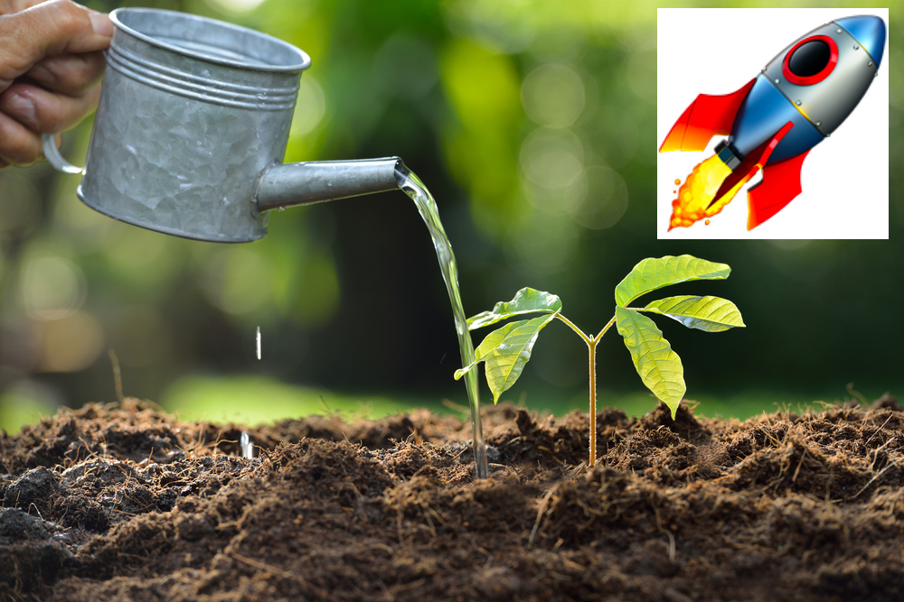

<!--
*** Thanks for checking out this README Template. If you have a suggestion that would
*** make this better, please fork the repo and create a pull request or simply open
*** an issue with the tag "enhancement".
*** Thanks again! Now go create something AMAZING! :D
-->


<!-- PROJECT SHIELDS -->
<!--
*** I'm using markdown "reference style" links for readability.
*** Reference links are enclosed in brackets [ ] instead of parentheses ( ).
*** See the bottom of this document for the declaration of the reference variables
*** for contributors-url, forks-url, etc. This is an optional, concise syntax you may use.
*** https://www.markdownguide.org/basic-syntax/#reference-style-links
-->
<!-- PROJECT LOGO -->
<br />
<p align="center">
  <a href="https://github.com/sparkgeo/template-barebones">
    
  </a>
  <h3 align="center">Water McSoil Watering App</h3>
</p>


<!-- TABLE OF CONTENTS -->
### Table of Contents

* [About the Project](#about-the-project)
* [Getting Started](#getting-started)
  * [Prerequisites](#prerequisites)
  * [Installation](#installation)
* [Usage](#usage)
* [License](#license)


<!-- ABOUT THE PROJECT -->
### About This Project

Soil moisture water detection application using a raspberry pi

```markdown
Features
- Intergrated Weather API
- A Dashboard displaying information
- Python Web Server 
```

<!-- GETTING STARTED -->
# Getting Started


### Prerequisites


# Installation

### List of install steps go here, ensure that everything is set up properly prior to installation.

1. [STEP 1]
2. [STEP 2]


<!-- USAGE EXAMPLES -->
# Usage Examples

1.
2. 
3. 
4. 
5. 

<!-- CONTRIBUTING -->
# Contributing and Contributors

The greatest team, Spacey-McSpaceFace
# Miscellaneous Links/Future Ideas
- Solar powered pi
- Modelling/Predicting when to water
- 


<!-- LICENSE -->
# License

Distributed under the Spacey-Force License. See `LICENSE` for more information.


